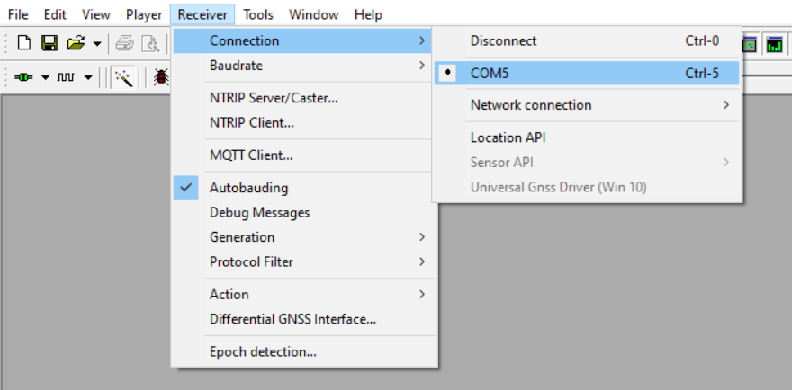
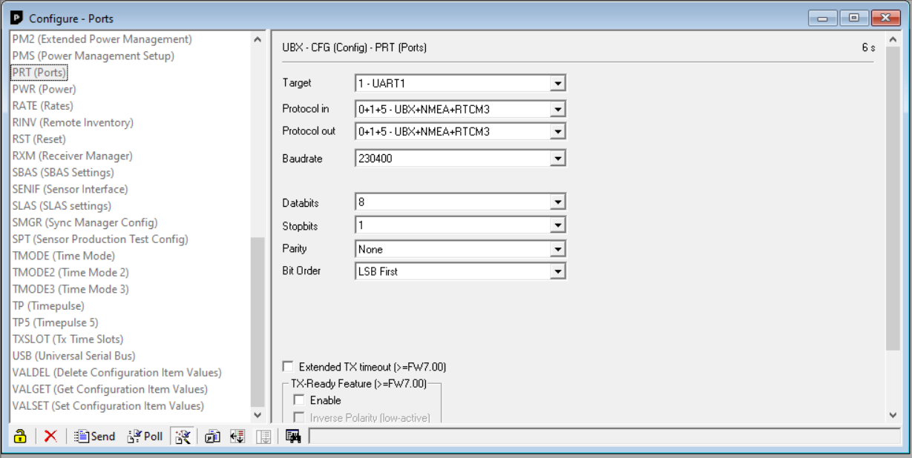
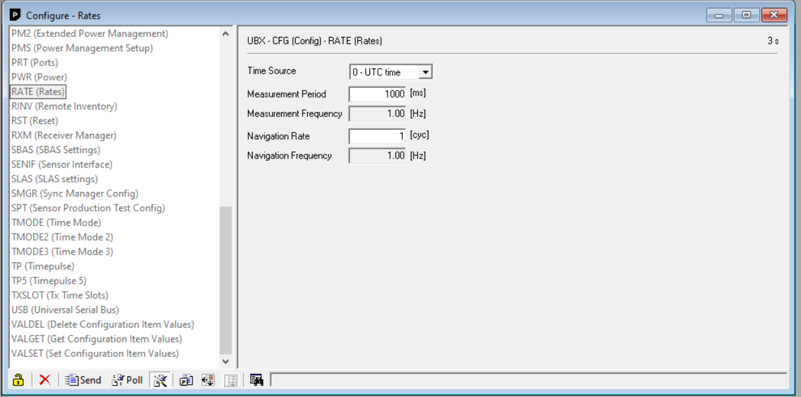
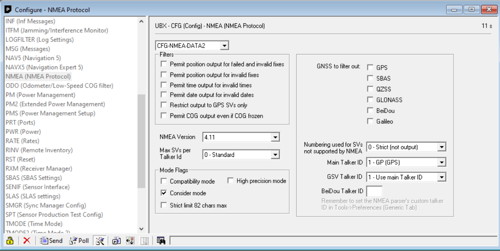
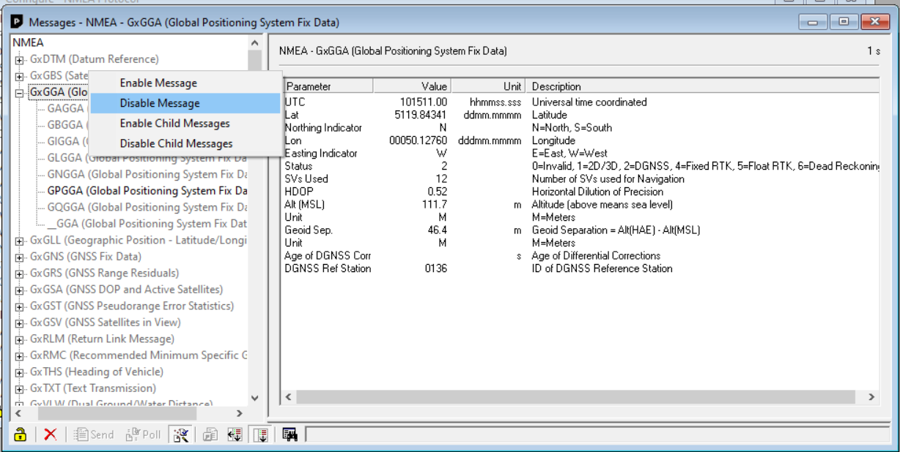
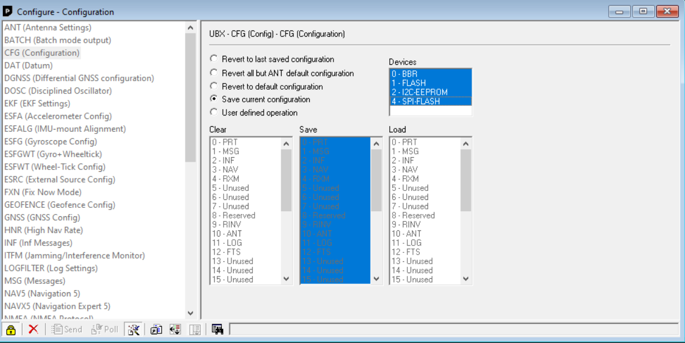

# U-blox GNSS Configuration
To aid positioning, the SPRINT-Nav accepts a GPGGA and GPZDA input. A U-blox GNSS receiver will not output these streams by default. The following document show how to configure such a receiver to aid with a SPRINT-Nav acquisition.

## Software Dependencies
* [u-center](https://www.u-blox.com/en/product/u-center) 
## Instructions

### Stream Messages
* Connect GNSS receiver to host PC
* Connect to the GNSS receiver via *Receiver* > *Connection* > *Valid COMM Port* 

* By default the BlueOS vehicle sets the output of the GNSS receiver to just *Protocol: 0 UBLOX*. However *Protocol: 1 NMEA* is also required. There is a default setting in BlueOS which will write over any user defined GNSS configuration, this extension will set the parameter, *GPS_AUTO_CONFIG*, to never overwrite the saved GNSS configuration. 
 The user needs to ensure at least both *Protocol: 0 + 1* are set as the *Protocol Out*. The user can decide what baudrate is required. For this example *230400* is used. Ensure that the databits, stop bits, parity and bit order, match the image below. Once this is the done, the user will need to click on the *Send* button, along the the bottom panel of the view. To access the *Ports* tab, go to *View* > *Configuration View* > *Ports*

* After the output protocols have been defined, the output rates need to be set to ensure the GNSS receiver is outputting messages at a rate of 1Hz. To access the *Rates* tab, go to *View* > *Configuration View* > *Rates*. The user will need to change *Measurement Period* to 1000ms. Once this is the done, the user will need to click on the *Send* button, along the the bottom panel of the view.

* The final step to finish streaming messages is to set the *Main Talker ID* for the NMEA messages. To access the *NMEA (NMEA PROTOCOL)* tab, go to *View* > *Configuration View* > *NMEA (NMEA PROTOCOL)*. The user will need to change *Main Talker ID* to *1 - GP (GPS)*. Once this is the done, the user will need to click on the *Send* button, along the the bottom panel of the view.

### Disable Unnecessary Messages 
The following section shows how to disable messages that are not GPGGA or GPZDA. This will stop the extension from getting flooded with traffic that is not required. It is advised that these steps are followed to allow minimum traffic into the extension and to stop blocking due to this traffic and therefore maintaining a realtime stream of GNSS messages.

The user must go to *View* > *Message Configuration* and right-click on every message type that is not *GGA*, *ZDA* or *UBX* and click *Disable Message* or *Disable Child Message* depending on what level the user is clicking.  

#### Saving the New Configuration 
Now that the GNSS receiver has been configured and the correct messages have been disabled, the configuration needs to be saved to allow the settings to persist between power cycles. To access the *CFG (Configuration)* tab, go to *View* > *Configuration View* > *CFG (Configuration)*. The user must select *Save current configuration* and highlight all the devices, as seen below. Once this is the done, the user will need to click on the *Send* button, along the the bottom panel of the view. This will now write the configuration to the GNSS receiver.

